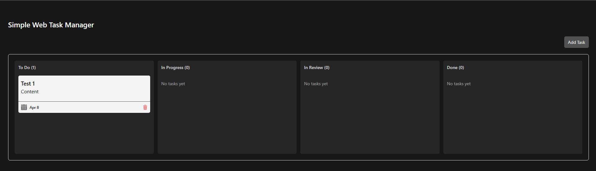
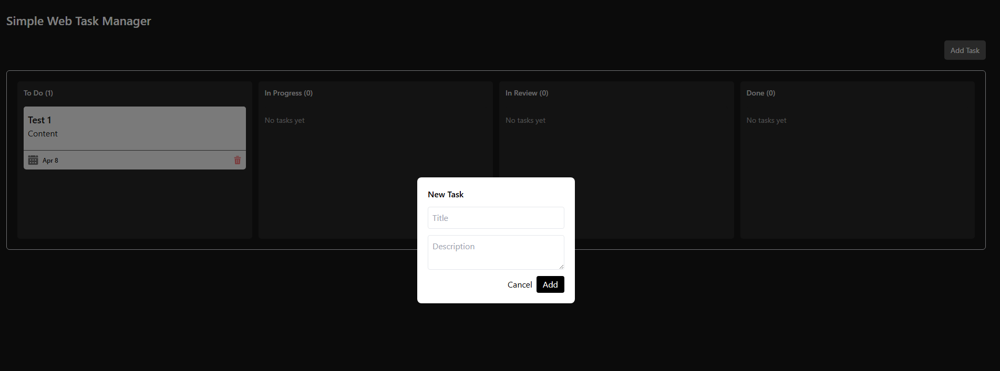
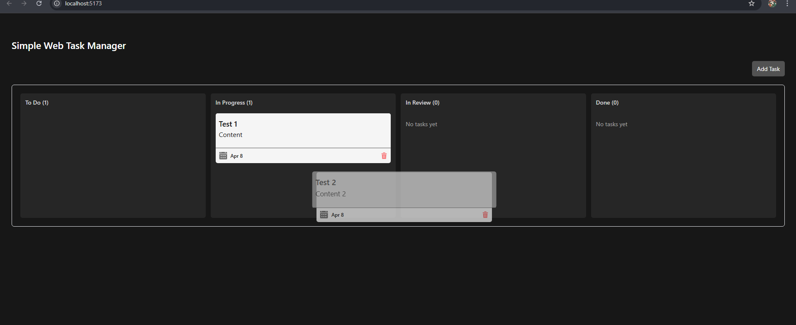

# 🧠 Task Manager Web App

A clean and interactive task management app built with React and TypeScript.  
Supports drag-and-drop between columns, persistent storage, and a modern UI.

---

## ✨ Features

- 📝 Create and delete tasks
- 🧲 Drag & drop tasks between columns
- 💾 Data persistence using localStorage
- 📱 Responsive layout
- 🌙 Clean dark UI
- 🧩 Modal-based task input
- 🗂 Multiple task states:
  - To Do
  - In Progress
  - In Review
  - Done

---

## 🛠 Tech Stack

- React
- TypeScript
- Tailwind CSS
- @dnd-kit (Drag & Drop)

---

## 📸 Preview

_Add screenshot here_

Example:





---

## 🚀 Getting Started

Clone the project:

```bash
git clone https://github.com/username/your-repo-name.git
cd your-repo-name
```

Install dependencies:

```bash
npm install
```

Run development server:

```bash
npm run dev
```

---

## 🌐 Live Demo

not yet

---

## 📁 Project Structure

```bash
src/
  components/
    Column.tsx
    TaskCard.tsx
  App.tsx
  main.tsx
```

---

## 🧠 What I Learned

- Managing state in React with TypeScript
- Handling drag-and-drop interactions using @dnd-kit
- Structuring reusable components
- Improving UX with modal and conditional rendering
- Handling edge cases (long text, event conflicts, etc.)

---

## 📌 Notes

This project was built as a learning step toward building more complex frontend applications with real-world interactions.

---

## 📄 License

Free to use for learning purposes.
